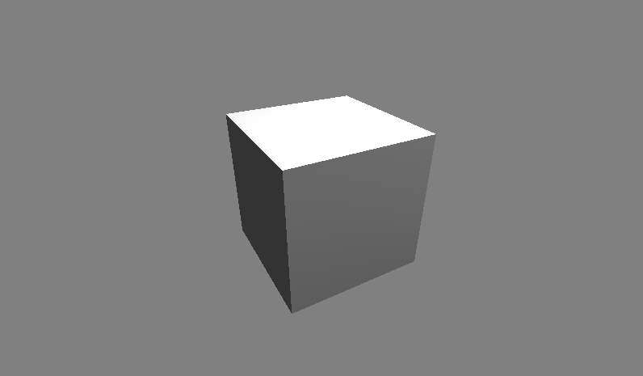

# OpenglBioilerplate
3D Opengl BoilerPlate 

 

This project is aimed at developing a streamlined pipeline for loading objects and experimenting with different shaders.
It is dedicated to run on Visual Studio 2019.

**Status/Comments** :: Currently Project is able to load an obj file (texture and material not supported) and renders with a point light.

Camera is now implemented, I am thinking of adding a tilt feature in it too. Which will involve rotating the coordinate axis on which pitch and yaw are based.

**Requirement**
- GLFW Library
- ASSIMP Library
- GLAD library
- GLM library

# TODO
- [x] Add point light
- [x] Add obj file support
- [x] Add a camera class, controlled by keyboard and mouse.
- [ ] Add material support
- [ ] Add texure support

Open to feedback and suggestions.
